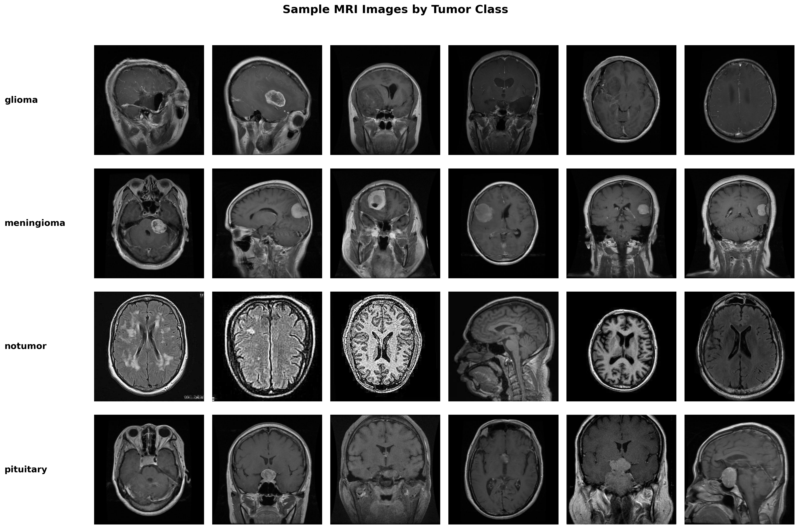
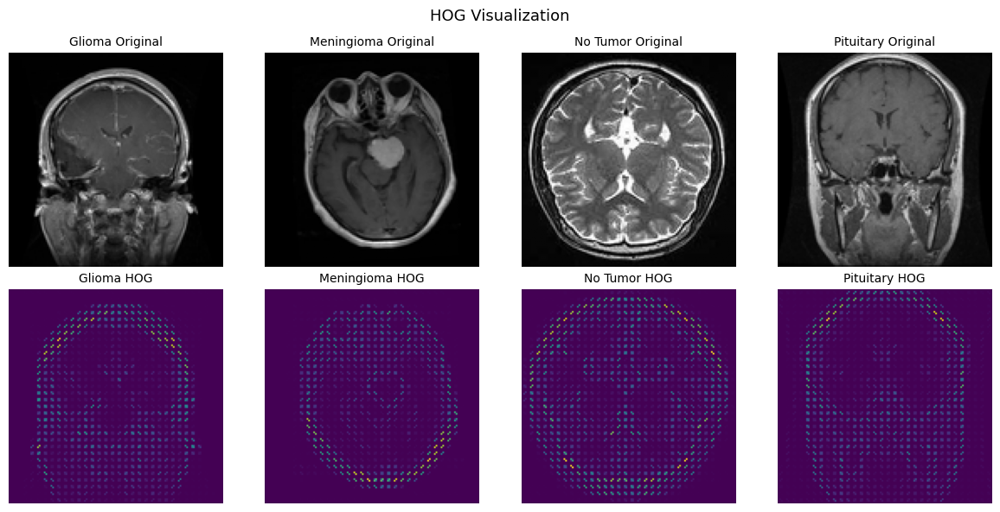
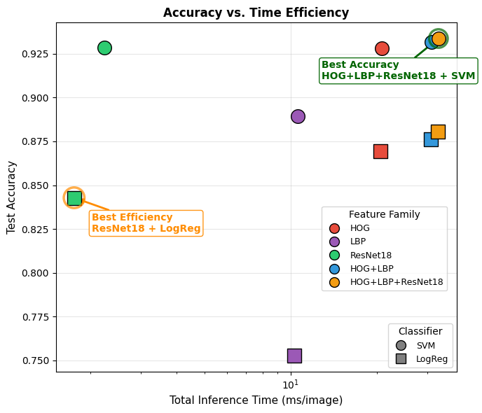
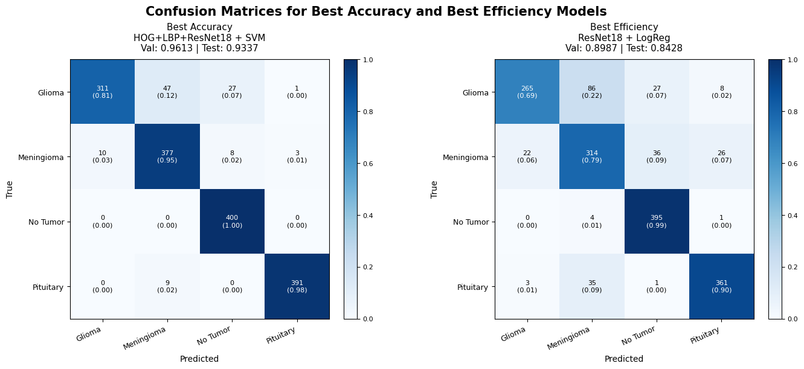

# Brain Tumor MRI Classification with Feature Fusion

Classifying brain MRI scans into glioma, meningioma, pituitary tumor, and no tumor using handcrafted computer vision features, pretrained ResNet embeddings, and feature fusion.

This project evaluates whether combining traditional image descriptors with deep visual embeddings can improve multiclass MRI classification. The final model fuses HOG, LBP, and ResNet-18 features, applies PCA for dimensionality reduction, and trains an SVM classifier on the combined representation.

> This project is intended for research and educational purposes only. It is not a diagnostic tool or clinical decision-making system.

## Overview

Brain tumor MRI classification is a computer vision task where both local texture and global image structure can be informative. Instead of relying on a single feature family, this project compares multiple representation strategies:

- **HOG features** for edge, gradient, and shape structure
- **LBP features** for local texture patterns
- **Pretrained ResNet-18 embeddings** for higher-level visual representations
- **Feature fusion** to combine handcrafted and deep representations
- **SVM and Logistic Regression classifiers** for downstream classification

The strongest model used fused HOG + LBP + ResNet-18 features with an SVM classifier.



## Dataset

The project uses the Brain Tumor MRI Dataset from Kaggle, which contains MRI images across four classes:

- Glioma
- Meningioma
- Pituitary tumor
- No tumor

The full dataset is not included in this repository due to size constraints. To reproduce the project, download the dataset separately from Kaggle and place it in the expected local data directory.

## Methods

### Exploratory Data Analysis

The exploratory analysis checked class composition, duplicate images, image resolution variation, pixel intensity patterns, and sample images across tumor classes. This helped identify preprocessing needs before feature extraction and modeling.

### Feature Extraction

The modeling pipeline used three complementary feature types:

| Feature Type | Purpose |
|---|---|
| HOG | Captures edges, gradients, and shape structure |
| LBP | Captures local texture patterns |
| ResNet-18 embeddings | Captures higher-level visual representations from a pretrained CNN |



### Feature Fusion

The core contribution of this project is the fusion of handcrafted and deep features. HOG and LBP provide interpretable low-level image descriptors, while ResNet-18 embeddings capture broader spatial and semantic patterns. Combining them allows the model to use complementary information from the MRI scans.

After feature extraction, PCA was applied to reduce dimensionality before training downstream classifiers.

### Modeling

The project compared several model configurations:

- CNN baseline
- HOG-only models
- LBP-only models
- ResNet-18 embedding models
- HOG + LBP feature fusion
- HOG + LBP + ResNet-18 feature fusion

The final best-performing configuration was:

```text
HOG + LBP + ResNet-18 features
PCA with 100 components
SVM classifier
```

## Results

The feature fusion model achieved the strongest overall performance.

| Model | Validation Accuracy | Test Accuracy |
|---|---:|---:|
| CNN baseline | N/A | 84.66% |
| ResNet-18 + SVM | N/A | 92.00% |
| HOG + LBP + ResNet-18 + SVM | 96.13% | 93.37% |



The final feature fusion model reached **93.37% test accuracy**, outperforming the CNN baseline and standalone ResNet comparison. These results suggest that handcrafted image features and pretrained deep embeddings can provide complementary signal for MRI classification.



## Flipped Image Robustness Experiment

An additional experiment tested model robustness on horizontally flipped MRI scans. This helped evaluate whether performance depended heavily on orientation-specific features or whether the model captured broader image patterns.

The ResNet-based features remained strong under flipped-image testing, suggesting that the model captured global context and higher-level visual representations beyond only local edge or texture features.

## Key Takeaways

- Feature fusion improved performance over simpler baselines.
- HOG captured edge and shape information, while LBP captured texture.
- ResNet-18 embeddings contributed higher-level visual representations.
- The fused HOG + LBP + ResNet-18 representation performed best with an SVM classifier.
- The flipped-image experiment suggested that ResNet features captured broader image context beyond orientation-specific patterns.
- This project is useful as a computer vision portfolio project because it compares interpretable handcrafted features against deep feature extraction.

## Limitations and Future Work

The project demonstrates strong classification performance, but it should be interpreted as an image classification experiment rather than a clinically deployable diagnostic system.

Important limitations include:

- The model was trained on a public MRI image dataset rather than a prospectively collected clinical dataset.
- The project performs image-level classification, not tumor segmentation or localization.
- The model does not incorporate radiologist annotations, clinical history, scanner metadata, or patient-level context.
- Dataset artifacts, preprocessing differences, and duplicate images can affect performance estimates.
- The final model predicts tumor class but does not explain spatial tumor boundaries.

Future work could extend the project in several directions:

- **Segmentation-aware modeling:** Add tumor localization or segmentation masks to evaluate whether the model focuses on clinically relevant regions.
- **External validation:** Test the model on MRI scans from a different institution or dataset to evaluate generalization.
- **Fine-tuned CNNs:** Fine-tune ResNet, EfficientNet, or Vision Transformer models end-to-end instead of using fixed embeddings only.
- **Explainability:** Use Grad-CAM or saliency maps to visualize which image regions influence predictions.
- **Patient-level splitting:** Ensure train/test separation at the patient level if patient identifiers are available.
- **Metadata integration:** Incorporate scanner type, imaging sequence, age, sex, or other clinical variables when available.
- **Calibration:** Evaluate whether predicted probabilities are well-calibrated for risk-aware interpretation.

## Repository Structure

## Repository Structure

```text
Brain-tumor-MRI-classification-with-feature-fusion/
├── README.md
├── EDA.ipynb
├── cnn_baseline.ipynb
├── final_classification_model.ipynb
├── flipped_test_experiment.ipynb
├── resnet_comparison.ipynb
├── final_report.pdf
└── images/
    ├── duplicates_by_class.png
    ├── feature_examples_hog_lbp_resnet.png
    ├── fig_color_barchart.png
    ├── fig_color_example.png
    ├── final_confusion_matrices.png
    ├── flipped_robustness_accuracy_efficiency.png
    ├── model_comparison_accuracy_efficiency.png
    ├── option1_step.png
    ├── option2_reordered.png
    ├── option3_mixed.png
    ├── resnet_pca_tsne_visualization.png
    ├── resolution_2x2.png
    ├── resolution_by_class.png
    ├── sample_grid.png
    ├── sample_grid_glioma.png
    ├── sample_grid_meningioma.png
    ├── sample_grid_notumor.png
    └── sample_grid_pituitary.png
```

## How to Run

The dataset is not included in this repository. To reproduce the project:

1. Download the Brain Tumor MRI Dataset from Kaggle.
2. Place the data in the expected local directory.
3. Run `EDA.ipynb` to inspect the dataset and preprocessing steps.
4. Run `cnn_baseline.ipynb` for the baseline CNN model.
5. Run `resnet_comparison.ipynb` for pretrained ResNet feature extraction experiments.
6. Run `final_classification_model.ipynb` for the feature fusion pipeline.
7. Run `flipped_test_experiment.ipynb` to evaluate robustness on horizontally flipped test images.

## Contributors

This was a collaborative computer vision project with Amanda Chung, Caitlin Gainey, and Clara Rhoades.

My contributions included work on the classification pipeline, feature fusion experiments, model evaluation, robustness testing, and interpretation of results.

## Disclaimer

This project is for research and educational purposes only. It is not intended for diagnosis, treatment decisions, clinical deployment, or real-time medical decision support.
